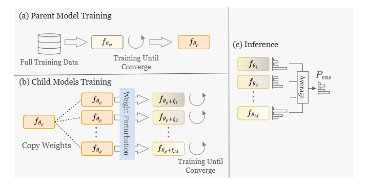

# NoisyDeepEnsemble
The official implementation of "NoisyDeepEnsemble: Accelerating Deep Ensemble Learning via Noise Injection"


### Overview
---
Noisy Deep Ensemble is a method to accelerate deep ensemble learning. First, a parent model is trained until it converges. Once the parent model has converged, its weights are copied and perturbed using a pre-determined noise distribution. Since the parent model has already reached a local minimum, these perturbed models will converge much faster. This approach allows us to efficiently obtain multiple ensemble models by following the principle of **"Train One Model, Perturb, Train Many Models."**

<div align="center">

</div>

### Installation
---
Run following commands.
```bash
git clone https://github.com/TSTB-dev/NoisyDeepEnsemble.git
cd NoisyDeepEnsemble
pip install -r requirements.txt
```

### Training
---
NOTE: Please check `scripts/train.sh` and give appropriate argumetns. 
```bash
bash scripts/train.sh
```

### Evaluation
---
```bash
bash scripts/evaluate.sh
```

## Citation
If you use this project in your research, please cite it as follows:
<!-- ```bibtex
@article{doe2024awesome,
  title={Awesome Project},
  author={Doe, John},
  journal={GitHub Repository},
  year={2024},
  url={https://github.com/username/repository}
} -->